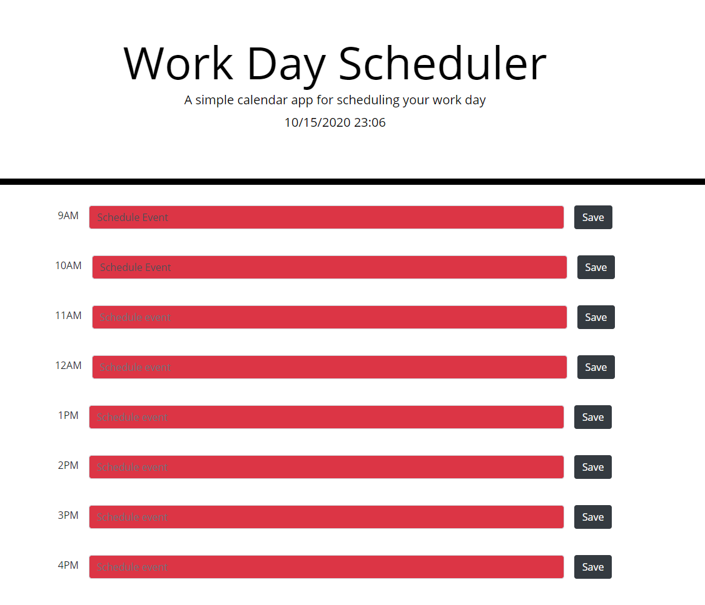

# 05_third_party_apis

## Third Party API Summary

* This is an event scheduler.

* The time is displayed above and tracked throughout the day.

* You can schedule and save events.

* Events are then highlighted based on the time of day.

* Green = future, Red = past time, Gray = current time.

## Images

## Links

https://sethglenn.github.io/04_code_quiz/04_code_quiz/